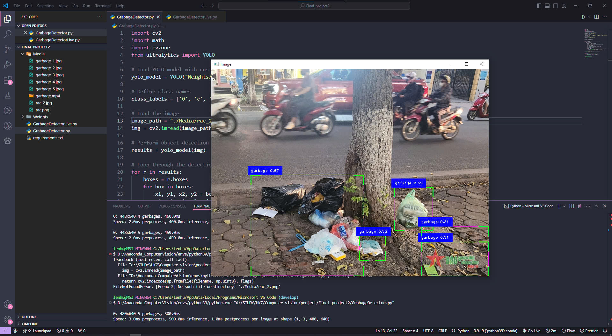

# COMPUTER VISION

## PROJECT NAME: GARBAGE DETECTION

## Technologies: python, YOLO(v8), OpenCV

## Datasets: roboflows.com

## Description: Detecting garbage on the road through images and videos

## Technology description:

> 'OpenCV' is used for image processing
> 'cvzone' helps draw bounding boxes
> 'YOLO - You Only Look Once' from the 'ultralytics' library is used for object detection

## Progam description:

> Load the YOLO model with the custom-trained weights and define the class names that YOLO can detect.
> Use the 'best.pt' weights and placed them in the correct directory.

### Main reasons to use yolo model:

- YOLO is renowned for its real-time processing capabilities, making it ideal for monitoring street conditions in real-time.
- YOLO has demonstrated high accuracy in object detection tasks, including identifying various types of litter.
- This ensures reliable detection of garbage, even in challenging conditions like low light or cluttered environments.
- YOLO models can be optimized for deployment on edge devices like cameras and drones.
- This enables decentralized garbage detection and monitoring, reducing the need for constant cloud-based processing.

### _Specific Benefits for Street Garbage Detection_:

- Improved Street Cleanliness: Real-time detection and notification can enable prompt cleanup operations, reducing litter accumulation.
- Data-Driven Decision Making: By analyzing detected garbage, city authorities can identify litter hotspots and optimize cleaning routes.
- Citizen Engagement: YOLO-powered systems can encourage citizen participation by providing real-time data on local litter levels.
- Environmental Monitoring: Tracking litter trends over time can help assess the effectiveness of cleaning initiatives and identify areas for improvement.
- Resource Optimization: By focusing cleaning efforts on high-litter areas, cities can allocate resources more efficiently.

_Results achieved_: Detecting garbage on the road through images

> 

### Evaluate:

- Use datasets with labeled images for training.
- Use Google Colab to train the model.
- Wrote a python program to detect trash in images and videos.
- Garbage was detected in images as well as in videos.
- The program works well.
